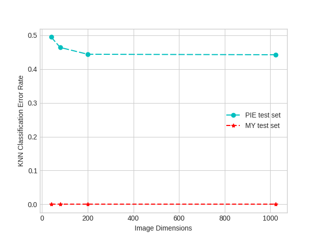
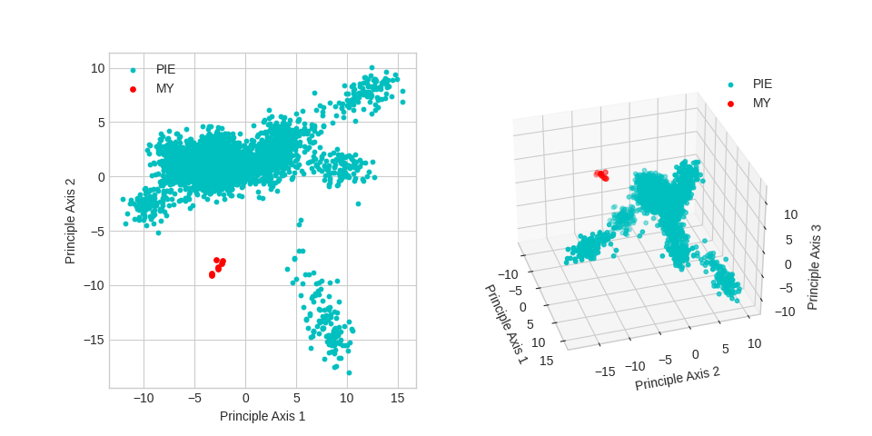

# face-recognition
## EE5907/EE5027 Pattern Recognition Programming Assignment CA2

> SS47816

## Pre-requisites
The packages I used here are very simple:

* python >= 3.6
* scipy
* numpy
* sklearn
* opencv
* troch
* torchvision
* matplotlib
* pathlib

### Installation

I am using `conda` environment so you can directly install the environment from file:

```bash
conda create --name pr --file requirements.txt
```

or 

```bash
pip install -r requirements.txt
```
### Usage

All the training data are stored in `data/`

CNN model `.pth` files are stored in `model/`

Resulted Figures are saved in `pics/`

TensorBoard logs are saved in `runs/`

Source codes are all stored in `src/`
* `cnn.py`: run this file to train and test the CNN models
* `conventional.py`: run this file to test all the conventional methods
* `create_dataset.py`: helper functions to split the train/test datasets

### Results
#### Q1. PCA for Feature Extraction, Visualization and Classification




#### Q2. LDA for Feature Extraction and Classification


#### Q3. GMM for Clustering


#### Q4. SVN for Classification


#### Q5. Neural Networks for Classification


